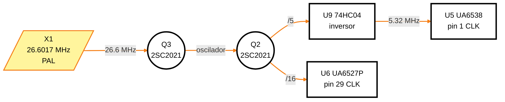
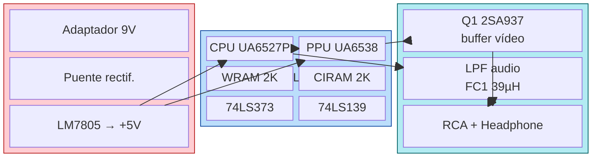
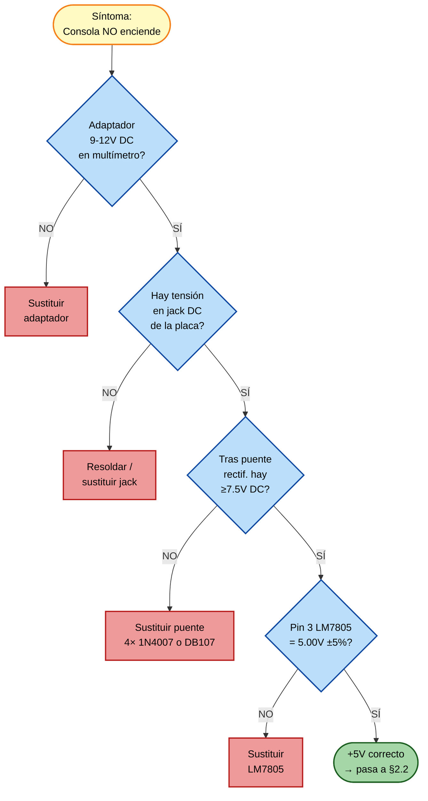
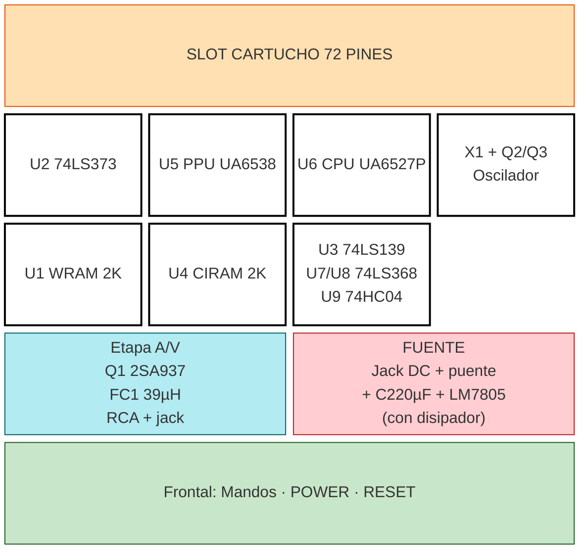
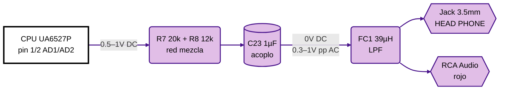

# SKILL — Diagramas Eléctricos con Mermaid

> **Premisa de partida:** Mermaid **no tiene sintaxis nativa de esquemas eléctricos** (no dibuja resistencias/condensadores con su símbolo IEC). Lo que sí hace muy bien es **diagramas de bloques, flujos de señal y árboles de decisión**. Esta skill convierte esa limitación en una ventaja: usamos un *lenguaje de bloques coloreado* que es más legible que un esquema clásico para alguien que está reparando.

## 1. Cuándo usar cada tipo de diagrama

| Necesidad | Tipo Mermaid | Por qué |
|-----------|--------------|---------|
| Cadena de alimentación (entrada → reg → carga) | `flowchart LR` | Direccional, simple, fácil de colorear |
| Bloques funcionales del sistema completo | `block-beta` | Permite columnas y posicionar bloques en grid |
| Flujo de señal (audio, vídeo, reloj) | `flowchart LR` | Una sola dirección, etiquetas en cada link |
| Árbol de diagnóstico (if/else por medida) | `flowchart TD` | Vertical, ramas, formas de decisión `{}` |
| Layout físico de la placa | `block-beta` con `columns` | Posicionado manual fila/columna |
| Mapa de memoria, registros | tabla Markdown | Mermaid no aporta nada aquí |
| Diagrama de tiempos | tabla o ASCII | Mermaid no soporta waveforms (mejor WaveDrom) |
| Pinout de un chip | tabla o `block-beta` | Tabla suele ser más clara |

## 2. Paleta de colores estándar (úsala siempre)

> **Regla:** una vez fijada esta paleta, **no introduzcas colores nuevos** sin razón. Mantenerla idéntica entre diagramas es lo que hace que un técnico la "lea" de un vistazo.

| Concepto | `fill` | `stroke` | `color` (texto) | Uso |
|----------|--------|----------|------------------|-----|
| **Power +5V / +Vcc** | `#ffcdd2` (rojo claro) | `#b71c1c` | `#000` | Líneas y nodos de alimentación regulada |
| **Power Vin (no regulado)** | `#ffe0b2` (naranja claro) | `#e65100` | `#000` | Antes del regulador |
| **GND** | `#cfd8dc` (gris azulado) | `#37474f` | `#000` | Masa |
| **Signal / Data bus** | `#bbdefb` (azul claro) | `#0d47a1` | `#000` | Buses de datos/dirección |
| **Clock** | `#fff59d` (amarillo) | `#f57f17` | `#000` | Líneas de reloj |
| **Audio** | `#e1bee7` (lila) | `#4a148c` | `#000` | Salida APU, RCA audio |
| **Video** | `#b2ebf2` (cian) | `#006064` | `#000` | VOUT, RCA vídeo |
| **Control / Reset / IRQ** | `#c8e6c9` (verde claro) | `#1b5e20` | `#000` | Reset, NMI, /CE, /OE |
| **IC activo (CPU/PPU/RAM)** | `#fff` (blanco) | `#000` (negro grueso) | `#000` | Chips principales, destacados |
| **OK / pasa medida** | `#a5d6a7` (verde) | `#1b5e20` | `#000` | Rama "todo correcto" en árboles |
| **FAIL / componente sospechoso** | `#ef9a9a` (rojo) | `#b71c1c` | `#000` | Rama "fallo encontrado" |
| **Acción** (medir, sustituir) | `#fff9c4` (amarillo pálido) | `#f57f17` | `#000` | Pasos manuales |
| **Punto de prueba (TP)** | `#fff` | `#000` con `stroke-dasharray` | `#000` | Nodos de medida |

Bloque reutilizable de `classDef` (cópialo tal cual al inicio de cada diagrama):

```text
classDef vcc      fill:#ffcdd2,stroke:#b71c1c,stroke-width:2px,color:#000
classDef vin      fill:#ffe0b2,stroke:#e65100,stroke-width:2px,color:#000
classDef gnd      fill:#cfd8dc,stroke:#37474f,stroke-width:2px,color:#000
classDef signal   fill:#bbdefb,stroke:#0d47a1,stroke-width:2px,color:#000
classDef clock    fill:#fff59d,stroke:#f57f17,stroke-width:2px,color:#000
classDef audio    fill:#e1bee7,stroke:#4a148c,stroke-width:2px,color:#000
classDef video    fill:#b2ebf2,stroke:#006064,stroke-width:2px,color:#000
classDef control  fill:#c8e6c9,stroke:#1b5e20,stroke-width:2px,color:#000
classDef ic       fill:#ffffff,stroke:#000000,stroke-width:3px,color:#000
classDef ok       fill:#a5d6a7,stroke:#1b5e20,stroke-width:2px,color:#000
classDef fail     fill:#ef9a9a,stroke:#b71c1c,stroke-width:2px,color:#000
classDef action   fill:#fff9c4,stroke:#f57f17,stroke-width:2px,color:#000
classDef tp       fill:#ffffff,stroke:#000000,stroke-width:1px,stroke-dasharray:4 2,color:#000
```

## 3. Convención de formas para componentes

Mermaid no dibuja resistencias ni condensadores. Mapea cada tipo de componente a una forma reconocible:

| Componente | Forma Mermaid | Sintaxis |
|------------|--------------|----------|
| IC, microcontrolador, regulador | rectángulo grueso | `U6[CPU UA6527P]` con clase `ic` |
| Conector / jack / puerto | hexágono | `J1{{Jack DC 9V}}` |
| Punto de prueba / nodo | círculo pequeño | `TP1((TP1))` con clase `tp` |
| Decisión (¿hay 5 V?) | rombo | `Q1{¿Hay 5V?}` |
| Capacitor electrolítico (filtro) | cilindro | `C1[(C1 220µF)]` |
| Resistencia / red R | rectángulo redondeado | `R1(R1 10kΩ)` |
| Cristal de cuarzo | trapecio (`[/.../]`) | `X1[/X1 26.6017MHz/]` |
| Bus (varias señales) | etiqueta con barras | `BUS[/" D0..D7 "/]` o usar arista gruesa |
| Subsistema (bloque de bloques) | `subgraph` | ver §4 |
| Fuente / batería | cilindro | `PSU[(Adaptador 9V)]` |
| Diodo | rombo etiquetado | `D1{D1}` con clase `signal` |
| Transistor | círculo etiquetado | `Q1((Q1 2SC2021))` |

## 4. Plantillas listas para usar

### 4.1 Cadena de potencia (flowchart LR)

```mermaid
flowchart LR
    PSU[(Adaptador 9V DC<br/>850mA)]:::vin
    J1{{Jack DC<br/>centro +}}:::vin
    BR[Puente rectificador<br/>4× 1N4007]:::vin
    C1[(C1 220µF<br/>filtro)]:::vin
    U1[LM7805<br/>TO-220]:::ic
    C2[(C2 0.1µF<br/>desacoplo)]:::vcc
    LOAD[CPU + PPU + RAM<br/>+ lógica TTL]:::vcc

    PSU -->|+9V DC| J1
    J1 -->|≈9V DC| BR
    BR -->|≈8V DC pulsante| C1
    C1 -->|≈8.5V DC<br/>rizado <200mV| U1
    U1 -->|+5.00V ±5%| C2
    C2 -->|+5V regulado<br/>800mA pico| LOAD

    classDef vin     fill:#ffe0b2,stroke:#e65100,stroke-width:2px,color:#000
    classDef vcc     fill:#ffcdd2,stroke:#b71c1c,stroke-width:2px,color:#000
    classDef ic      fill:#ffffff,stroke:#000000,stroke-width:3px,color:#000
```



### 4.2 Generador de reloj con red de transistores (flowchart LR)



### 4.3 Bloques funcionales del sistema (block-beta)



### 4.4 Árbol de diagnóstico (flowchart TD)



### 4.5 Layout físico de la placa (block-beta posicional)



### 4.6 Flujo de señal de audio (flowchart LR)



## 5. Reglas de estilo (mejores prácticas)

### Hacer

- **Una dirección dominante**: `LR` para flujos lineales, `TD` para árboles. No mezclar.
- **Etiquetar todas las flechas relevantes** con la señal o tensión que llevan: `-->|+5V|`, `-->|CLK 1.66 MHz|`, `-->|D0..D7|`.
- **Separar `classDef` al final del bloque** para que el grafo lea claro arriba.
- **`linkStyle` para colorear los enlaces** según tipo (rojo potencia, naranja reloj, azul datos, lila audio, cian vídeo). Importante: `linkStyle 0,1,2 stroke:#color` se referencia por **índice** del orden en que aparecen los enlaces.
- **Mayúsculas/sigla para IDs cortos** (`CPU`, `PPU`, `U6`, `Q1`); el contenido del nodo va dentro de las llaves `[...]`.
- **`<br/>` para multilínea** dentro de un nodo.
- **Anchura `:N`** en `block-beta` para que un bloque ocupe varias columnas y dé sensación de jerarquía.
- **Versión "esqueleto + capa de color"**: primero genera el grafo en blanco y negro, luego añade colores. Si añades color desde el principio puedes esconder errores topológicos.

### No hacer

- ❌ Emojis dentro de nodos: rompen el render en GitHub. Usa entidades HTML o palabras (`OK` mejor que ✅).
- ❌ Colores fluo sin contraste con texto negro. Comprueba que los `fill` claros del §2 leen bien.
- ❌ Más de **15–20 nodos** en un mismo diagrama: divídelo en sub-diagramas.
- ❌ Aristas curvadas con muchos cruces: si pasa, replantea con `subgraph` o usa `block-beta`.
- ❌ Mezclar idiomas en etiquetas; si la doc está en español, los nodos en español.
- ❌ Usar mermaid para esquemas con más de ~30 componentes y conexiones complejas: en ese caso documenta con tabla y referencia al PDF de KiCad/esquema original.

## 6. Workflow recomendado para producir un diagrama

```mermaid
flowchart LR
    A([1. Identificar<br/>qué quieres mostrar]):::action
    B([2. Elegir tipo<br/>según §1]):::action
    C([3. Esqueleto<br/>nodos + flechas]):::action
    D([4. Aplicar<br/>classDef del §2]):::action
    E([5. Etiquetar señales<br/>con voltaje/freq.]):::action
    F([6. Probar render<br/>en mermaid.live]):::action
    G([7. Pegar en .md<br/>con triple backticks]):::ok

    A --> B --> C --> D --> E --> F --> G

    classDef action  fill:#fff9c4,stroke:#f57f17,stroke-width:2px,color:#000
    classDef ok      fill:#a5d6a7,stroke:#1b5e20,stroke-width:2px,color:#000
```



## 7. Referencias canónicas

- Sintaxis general: <https://mermaid.js.org/syntax/examples.html>
- Block diagram: <https://mermaid.ai/open-source/syntax/block.html>
- Tips Christopher Allen: <https://gist.github.com/ChristopherA/bffddfdf7b1502215e44cec9fb766dfd>
- Live editor: <https://mermaid.live>

## 8. Checklist antes de pegar un diagrama en la documentación

```
[ ] Tipo correcto según §1
[ ] Paleta del §2 aplicada (sin colores nuevos)
[ ] Formas del §3 respetadas
[ ] Cada flecha relevante etiquetada con su señal/tensión
[ ] linkStyle aplicado para colorear las aristas críticas
[ ] Diagrama probado en mermaid.live
[ ] Render OK en GitHub (vista previa del .md)
[ ] Texto en español, sin emojis, sin caracteres raros
```
