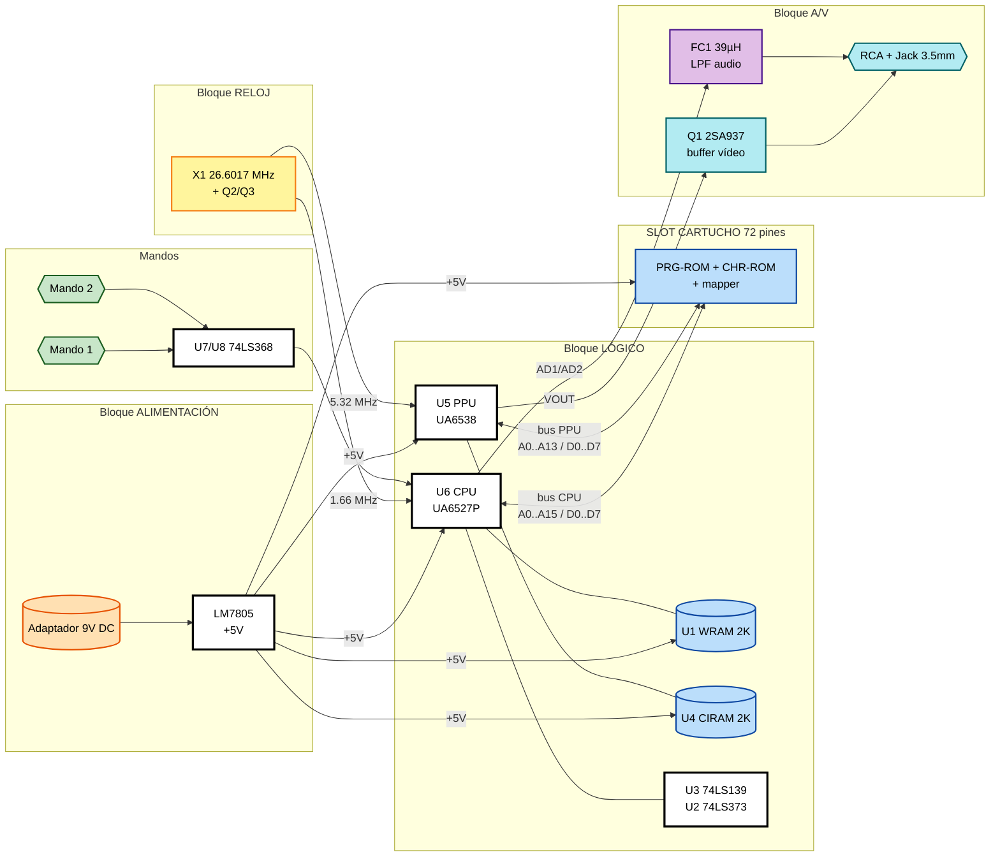
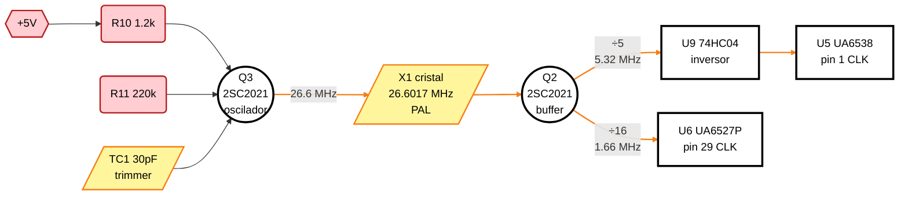
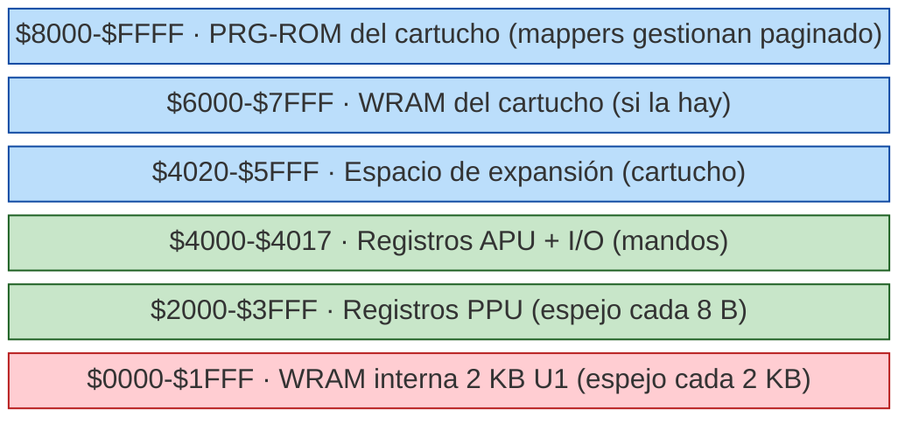
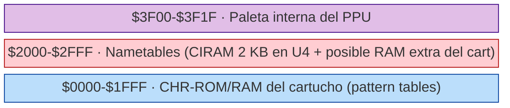
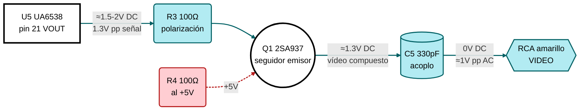
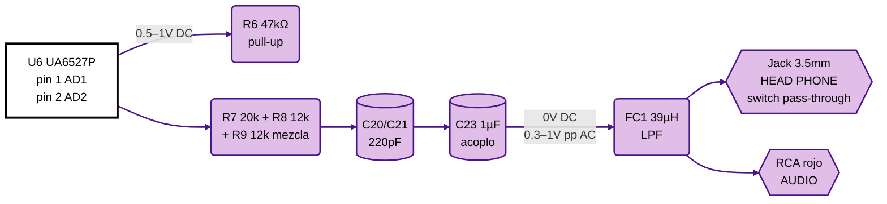
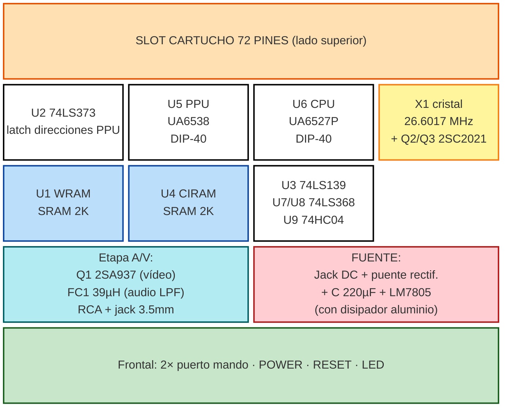

# SKILL 2 — Arquitectura y Esquemas de la NASA NS-90AP

> **Referencia primaria:** esquemas redibujados del NES-001 y HVC-001 Famicom (ambos en `datasheets/`). La NS-90AP es eléctricamente un Famicom con conector NES de 72 pines y sin CIC. Los nodos y nombres de señal coinciden.

## 0. Identificación rápida del modelo

- **Etiqueta culo de consola**: `MODEL: NS-90AP`, `RATING: DC 10V 850 mA`, `SALE NO. 0xxxxx`, `MADE IN TAIWAN`.
- **Conexión trasera**: jack DC de barril (centro positivo) + jack 3.5 mm rotulado `RF SWITCH` (no lleva modulador RF interno: el jack puede estar **sin uso** o ser un secundario del audio).
- **Conexión frontal/lateral**: jack 3.5 mm `HEAD PHONE` + RCA rojo `AUDIO` + RCA amarillo `VIDEO`.
- **Mandos**: 2 puertos D-sub estilo NES rotulados `1 TURBO PAD 2`.

## 1. Bloque de alimentación

### 1.1 Cadena de potencia

```mermaid
flowchart LR
    PSU[(Adaptador externo<br/>9-12V DC<br/>850mA)]:::vin
    J1{{Jack DC<br/>centro +}}:::vin
    BR[Puente rectificador<br/>4× 1N400x o DB107]:::vin
    C1[(C1 220µF / 25V<br/>filtro)]:::vin
    U1[LM7805<br/>TO-220<br/>con disipador]:::ic
    C2[(C2 0.1µF<br/>desacoplo)]:::vcc
    LOAD[CPU + PPU + RAMs<br/>+ TTL + slot<br/>+ etapa A/V]:::vcc

    PSU -->|"+9-12V DC"| J1
    J1 -->|"≈9V DC"| BR
    BR -->|"≈8V DC pulsante"| C1
    C1 -->|"≈8.5V DC<br/>rizado <200mV"| U1
    U1 -->|"+5.00V ±5%"| C2
    C2 -->|"+5V regulado"| LOAD

    classDef vin     fill:#ffe0b2,stroke:#e65100,stroke-width:2px,color:#000
    classDef vcc     fill:#ffcdd2,stroke:#b71c1c,stroke-width:2px,color:#000
    classDef ic      fill:#ffffff,stroke:#000000,stroke-width:3px,color:#000
    linkStyle 0,1,2,3 stroke:#e65100,stroke-width:2px
    linkStyle 4,5 stroke:#b71c1c,stroke-width:3px
```

### 1.2 Tensiones esperadas

| Nodo | Valor esperado | Tolerancia |
|------|----------------|------------|
| Salida del adaptador en jack DC | 9–10 V DC (sin carga puede subir a 11–13 V) | ±10 % |
| Después del puente rectificador, antes del electrolítico | 8–11 V DC pulsante | rizado < 1 V pp |
| Tras electrolítico de filtro | 8.5–11 V DC con rizado ≤ 200 mV | — |
| Pin 1 (IN) del LM7805 | ≥ 7.5 V DC en operación, idealmente 8–10 V | mínimo absoluto: 7 V |
| Pin 3 (OUT) del LM7805 = +5V | **5.00 V** | ±5 % (4.75–5.25 V) |
| GND (pin 2 del 7805, pestaña, masa de RCA) | 0.000 V | continuidad <1 Ω entre todas las masas |

### 1.3 Notas sobre el adaptador

- La etiqueta indica `DC 10V 850 mA`. El **puente rectificador** está en placa porque algunos adaptadores originales eran AC y otros DC: el puente protege contra inversión de polaridad y rectifica si hubiera AC.
- Con un adaptador DC 9 V 850 mA centro-positivo se obtiene ~7.8 V tras el puente (caída de 1.2–1.4 V por dos diodos en serie). Está justo por encima del dropout del LM7805 (2 V máx → necesita Vin ≥ 7 V para 5 V de salida). Funciona, pero **al límite** bajo carga.
- Recomendación práctica: usar adaptador **9–12 V DC**, ≥ 1 A, centro positivo. Si se quiere maximizar margen térmico del 7805, no exceder 12 V (más V_in = más W disipados).

### 1.4 Disipación y térmica

- LM7805 con disipador de aluminio atornillado (visible en las fotos). La pestaña es GND.
- A 5 V salida, 9 V entrada, ~600 mA de consumo típico en juego: P = (9–5)·0.6 = **2.4 W**. Disipador es necesario; sin él, el TO-220 supera 100 °C en minutos.
- Protecciones internas: limitación de corriente (~2.1 A pico), cortocircuito, apagado térmico a 150 °C de unión.

## 2. Bloque lógico

### 2.0 Visión global del sistema

### 2.1 Chipset principal

| Designador | Chip | Equivalente Nintendo | Pines | Función |
|------------|------|----------------------|-------|---------|
| **U6** (CPU) | UMC **UA6527P** | Ricoh **2A07** (PAL) ≈ 2A03 | DIP-40 | CPU 6502 modificada + APU (audio) + lectura de mandos |
| **U5** (PPU) | UMC **UA6538** | Ricoh **2C07** (PAL) ≈ 2C02 | DIP-40 | Procesador gráfico + salida vídeo compuesto |
| **U1, U4** | TMM2115 o equivalente SRAM 2K×8 | — | DIP-24 | U1 = WRAM CPU 2 KB; U4 = CIRAM PPU 2 KB (nametables) |
| **U2** | 74LS373 | — | DIP-20 | Latch de la dirección PPU multiplexada (PPU_AD0–7 → PPU_A0–7) |
| **U3** | 74LS139 (dual 2:4) | — | DIP-16 | Decodificación: U3A = `CPU_RAM_CS` y `PPU_CS`, U3B = `ROMSEL` |
| **U7, U8** | 74LS368 (hex buffer 3-state) | — | DIP-16 | Buffers de los mandos (P1/P2 → bus de datos del CPU) |
| **U9** | 74HC04 (hex inverter) | — | DIP-14 | Inversores varios (CLK PPU, reset, ALE) |
| **U10** | (No poblado en NS-90AP) | 3193A CIC | — | **Ausente**: no hay chip de bloqueo regional |

### 2.2 Generación de reloj

Bloque crítico — todo depende de él. En la NS-90AP es un oscilador discreto (no un módulo encapsulado), idéntico topológicamente al del Famicom HVC-001 pero con cristal PAL.

- **Cristal X1**: **26.6017 MHz** (PAL). En la NES-001 PAL es el mismo; el HVC-001 NTSC lleva 21.47727 MHz.
- **Q2, Q3**: 2SC2021 (NPN RF). Q3 mantiene la oscilación, Q2 buffer.
- **Red de polarización**: R10 1.2 kΩ, R11 220 kΩ, R12 1.2 kΩ, R13 150 kΩ, TC1 30 pF (cap. ajustable), C3 51 pF, C22 18 pF.
- **Salida a CPU**: directamente a pin 29 (CLK) del UA6527P.
- **Salida a PPU**: pasa por C45 51 pF (acoplo) hacia U9 74HC04 (inversor) y de ahí al pin 1 (CLK) del UA6538.

### 2.3 Mapas de memoria

**CPU (espacio de direcciones 16 bits):**

**PPU (espacio de 14 bits, multiplexado por ALE):**

### 2.4 Bus del cartucho (slot 72 pines)

Pinout completo en `datasheets/NES-Famicom-cartridge-pinouts.pdf`. Pines críticos para diagnóstico:

| Pin NES | Señal | Sentido | Cómo verificar |
|---------|-------|---------|----------------|
| 36 | +5 V | OUT | medir 5 V con cartucho fuera y dentro |
| 1, 72 | GND | OUT | continuidad con masa chasis |
| 38 | Ø2 (CPU_M2) | OUT | reloj CPU ~1.66 MHz |
| 37 | Ø2 → CPU CLK | OUT | reloj CPU |
| 39–41 | PRG_A12–A14 | OUT | señales de dirección activas durante lectura |
| 50 | /PRG ROM CE | OUT | activo bajo cuando CPU lee $8000–$FFFF |
| 14 | PRG R/W | OUT | alto en lectura, bajo en escritura |
| 21 | /CHR RAM RD | OUT | lectura del PPU |
| 56 | /CHR RAM WR | OUT | escritura del PPU |
| 22, 57 | /VRAM CE / VRAM A10 | OUT | espejo de nametables |
| 34, 35, 70, 71 | LOCKOUT (CIC) | — | **no usados en NS-90AP** (NC) |

### 2.5 Mandos

- Conector D-sub 7 pines (compatible NES).
- Pinout: 1=GND, 2=GND, 3=`/OE2` (latch P2) o `OUT0` (strobe), 4=clock (`OUT0`), 5=`P1_D0` (datos serie P1) ó `P2_D0`, 6=NC, 7=+5 V.
- El UA6527P escribe a $4016 para hacer latch del estado de los botones (8 bits) y luego lee secuencialmente desplazando con sucesivas lecturas a $4016/$4017.
- Buffers U7/U8 (74LS368) llevan las líneas de datos al bus.
- Resistor pack RA1 (12×10 kΩ) o RA2 (5×6.8 kΩ): pull-ups de las líneas de los mandos en placa.

## 3. Bloque de A/V

### 3.1 Salida de vídeo compuesto

- El UA6538 entrega un vídeo compuesto en su pin 21 (`VOUT`), nivel ~1.3 V pp con sincronismo embebido.
- **Buffer de vídeo**: transistor PNP **2SA937** (Q1) en configuración seguidor de emisor, polarizado por R3 100 Ω entre VOUT y la base, y R4 100 Ω en colector hacia +5 V; emisor → C5 330 pF de acoplo → conector RCA amarillo.
- En la NS-90AP el RCA amarillo es la salida directa de este buffer; no hay modulador RF.

Tensiones esperadas:
- Pin 21 (VOUT) PPU: **~1.5–2.0 V DC** con consola encendida, video compuesto montado encima.
- Base de Q1 (2SA937): ~2.0 V DC.
- Emisor de Q1: ~1.3 V DC (centro de la señal).
- En el RCA amarillo (DC bloqueado por C5): nivel medio ≈ 0 V DC, señal AC ~1 V pp.

### 3.2 Salida de audio

> **Nota crítica:** el jack de auriculares lleva un **switch mecánico**: al insertar el conector corta físicamente la salida hacia el RCA y el altavoz interno. Si el switch está sucio o vencido, la consola se queda muda aunque no haya nada conectado.

- El UA6527P entrega audio en su pin 1 (AD1) y pin 2 (AD2) — mezcla pre-amplificada de las 5 voces APU.
- Filtro pasivo: R6 (≈ 20 kΩ), R7, R8, R9, C20, C21, condensador de acoplo C23 1 µF, inductor FC1 39 µH (LPF anti-aliasing).
- La señal sale directamente al RCA rojo `AUDIO` y, vía divisor o switch, al jack `HEAD PHONE` 3.5 mm. **El jack del headphone suele cortar mecánicamente la salida del altavoz/RCA** al insertarse: si el contacto no funciona, no habrá sonido por RCA hasta retirar el conector.

Tensiones esperadas:
- Pines AD1/AD2 del CPU: 0.5–1.0 V DC con audio activo.
- Después de C23 (acoplo): nivel medio 0 V, señal AC 0.3–1 V pp en presencia de sonido.
- En RCA rojo: 0.3–1 V pp AC; 0 V DC.

### 3.3 Reset

- Pulsador `RESET` en panel frontal puentea el pin 3 (`/RESET`) del CPU y del PPU a GND mientras está pulsado.
- Capacitor C1 0.47 µF a masa proporciona retardo de "reset al encender" (power-on reset).
- Tensión esperada en `/RESET`: 5 V DC en operación normal, 0 V durante el reset.

## 4. Mapa físico de la placa (orientación)

Con la consola abierta y el frontal hacia ti (mandos cerca):

## 5. Diferencias respecto al NES-001 oficial (relevantes para reparar)

1. **Sin chip CIC 10NES (U9, U10 en esquema NES)**: las líneas `LOCKOUT_CHIP` (pines 34, 35, 70, 71) están al aire o a Vcc/GND. **Eso quiere decir que ningún fallo de "luz roja parpadeante" puede atribuirse a un CIC en la NS-90AP — no lo tiene.**
2. **Sin modulador RF**: el bloque `RF_MOD1` del NES-001 no existe. Hay sólo cableado directo a RCA.
3. **Sin conector de expansión inferior** (`AUX1` en NES-001): los pines `EXP0–EXP9` del slot pueden estar al aire en el lado del cartucho (NC) o conectados sólo internamente.
4. **Reloj PAL**: 26.6017 MHz vs 21.47727 MHz NTSC.
5. **Conector de cartucho 72 pines no-ZIF**: contactos a presión directos. Mucho más sensible a oxidación.

Cualquier referencia a "el CIC", "el ZIF", "el modulador RF" en una guía de reparación NES genérica **no aplica** a esta consola.
