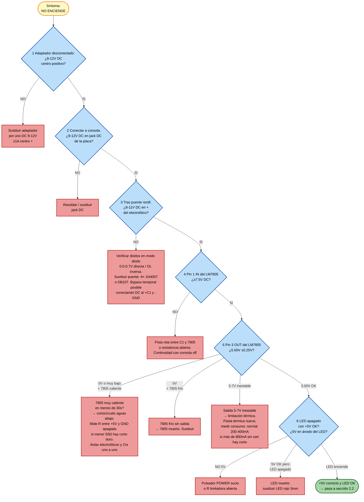
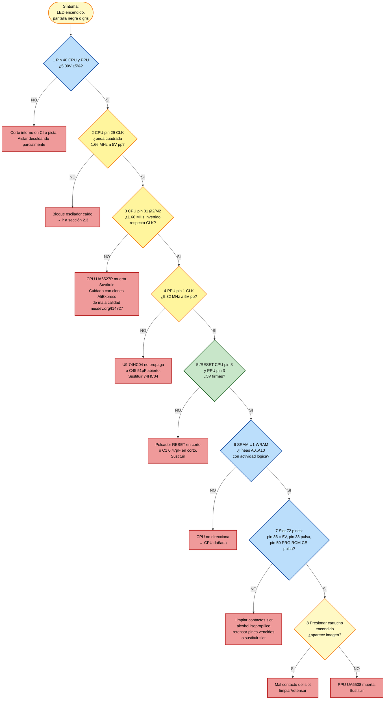
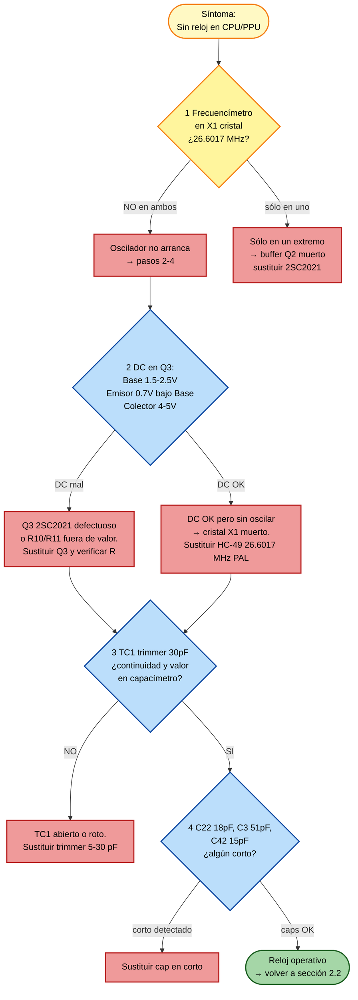
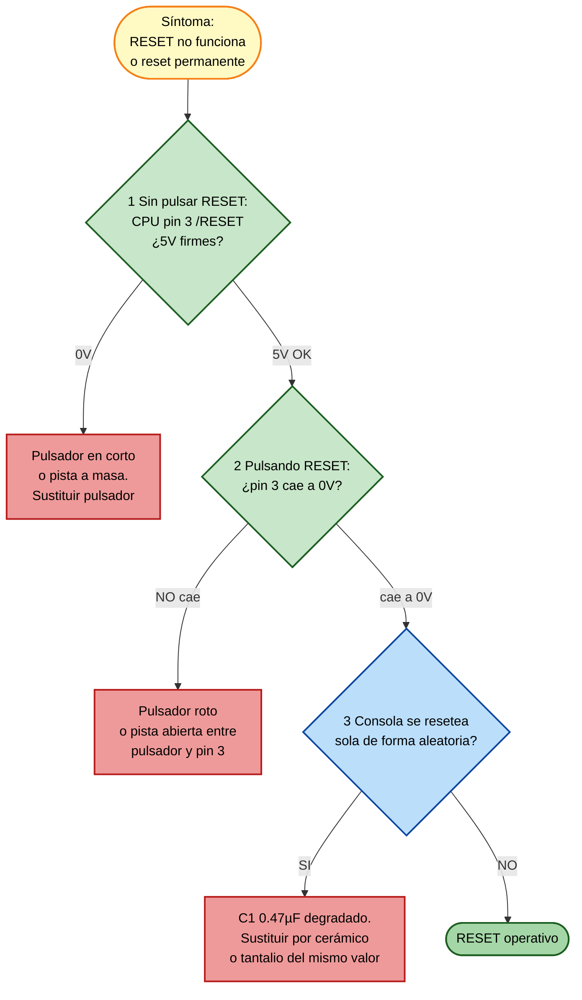
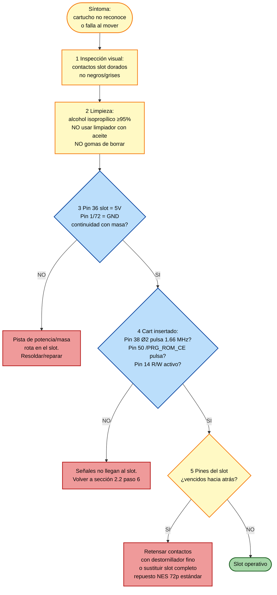
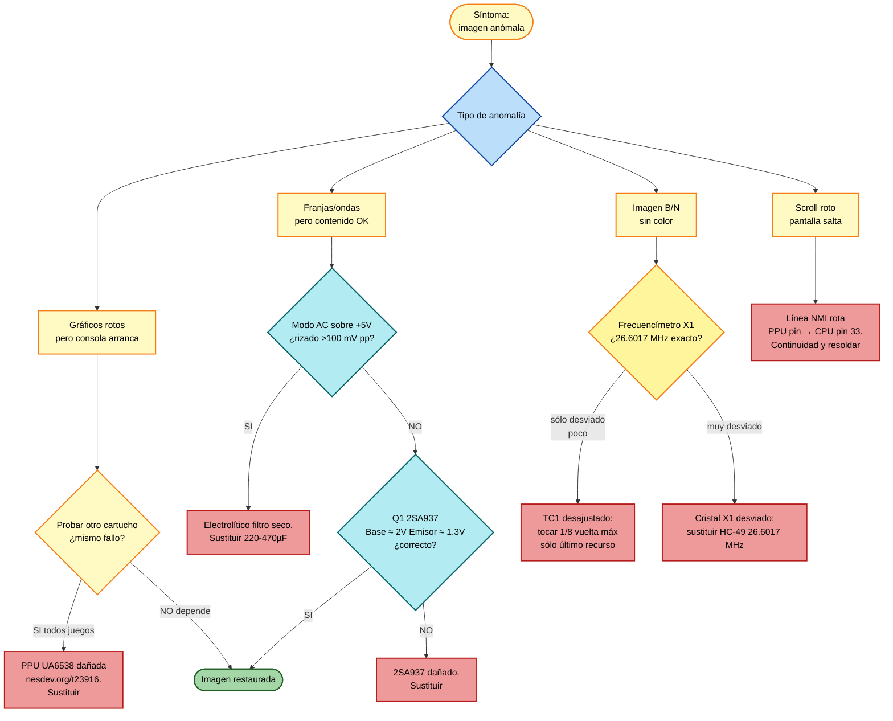
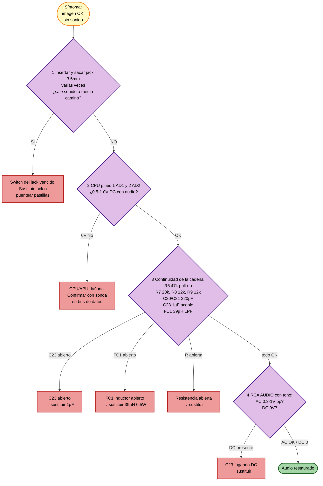
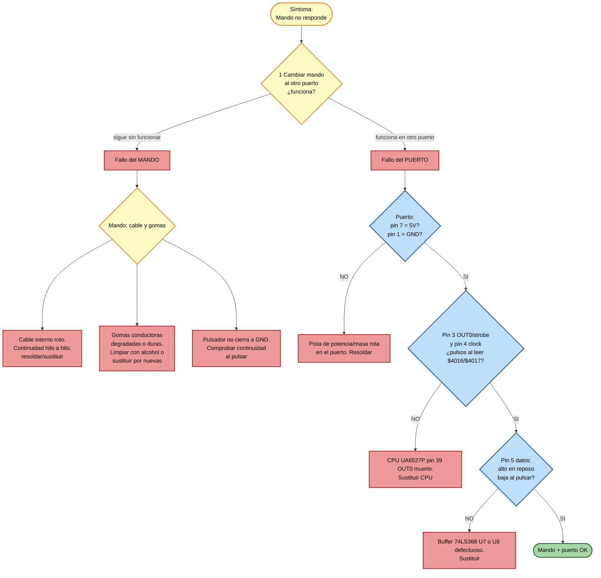
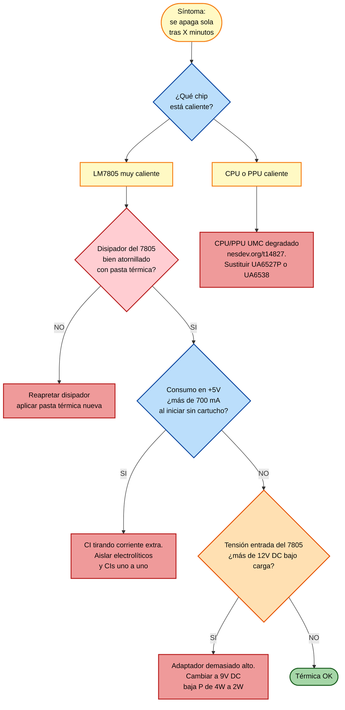
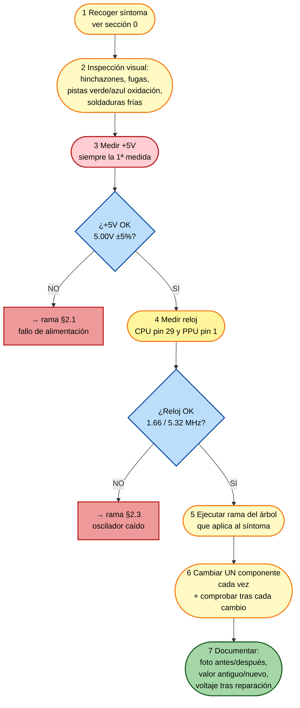

# SKILL 3 — Troubleshooting NASA NS-90AP

> **Cómo usar esta skill (instrucciones para el agente):**
> 1. Pregunta primero el síntoma exacto y observable (LED, pantalla, sonido, mando).
> 2. Identifica la rama del árbol que aplica (sección 2).
> 3. Pide medidas sólo en el orden indicado: nunca hagas medir todo a la vez. Una medida → una decisión → la siguiente medida.
> 4. Al cerrar el caso, registra qué se cambió y qué voltaje quedó después de la reparación.

## 0. Información previa que debe tener el agente

Antes de bajar al árbol, recopila:

- ¿LED de POWER enciende? (sí / no / parpadea)
- ¿Hay imagen? (negra / gris / con interferencias / con gráficos pero corruptos / sí pero sin sonido)
- ¿Se calienta algo de forma anómala en los primeros 30 s? (sí — qué chip / no)
- ¿Cartucho metido y limpio? Probar **mínimo dos cartuchos distintos** antes de declarar fallo de consola.
- Adaptador en uso: tensión y polaridad. Comprobar con multímetro **antes** de conectar a la consola.

## 1. Voltajes de referencia rápidos (consola encendida, cartucho insertado, juego corriendo o pantalla)

Usa esta tabla como "north star". Cualquier desviación >5 % apunta a la rama correspondiente.

| Punto de medida | Esperado | Si está fuera de rango → mira sección |
|-----------------|----------|---------------------------------------|
| Jack DC (pin central) respecto al anillo | +9 a +12 V DC | §2.1 |
| Tras puente rectificador (+ del electrolítico de filtro) | +8 a +11 V DC, rizado <200 mV | §2.1 |
| **LM7805 pin 1 (IN)** | ≥ 7.5 V DC | §2.1 |
| **LM7805 pin 3 (OUT) = +5V** | **5.00 V ±0.25 V** | §2.2 |
| **CPU UA6527P pin 40 (Vcc)** | 5.00 V | §2.2 |
| **CPU UA6527P pin 20 (GND)** | 0.00 V | §2.2 |
| **PPU UA6538 pin 40 (Vcc)** | 5.00 V | §2.2 |
| CPU pin 29 (CLK) | onda cuadrada ~1.66 MHz, ~5 V pp | §2.3 |
| PPU pin 1 (CLK) | onda cuadrada ~5.32 MHz, ~5 V pp | §2.3 |
| CPU pin 31 (Ø2 / M2) | onda cuadrada ~1.66 MHz, mismo periodo que CLK | §2.3 |
| CPU pin 3 (/RESET) | 5 V (alto) en operación; 0 V mientras se pulsa RESET | §2.4 |
| Pin 36 del slot (+5V cartucho) | 5.00 V | §2.5 |
| PPU pin 21 (VOUT, vídeo) | ~1.5–2.0 V DC con señal montada | §2.6 |
| CPU pin 1/2 (AD1/AD2, audio) | 0.5–1.0 V DC con audio activo | §2.7 |

## 2. Árboles de diagnóstico por síntoma

### 2.1 SÍNTOMA: La consola NO ENCIENDE (LED apagado, sin imagen)

### 2.2 SÍNTOMA: LED enciende, pantalla NEGRA o GRIS sin imagen

> "Pantalla gris" en NES significa que el PPU genera el blanking pero la CPU no escribe en sus registros (PPU desactivado). Casi siempre es la CPU o su reloj.

### 2.3 SÍNTOMA: Reloj caído (oscilador no oscila)

### 2.4 SÍNTOMA: Botón RESET no funciona o se queda en reset permanente

### 2.5 SÍNTOMA: Cartucho no se reconoce / fallos aleatorios al menear

> Es el fallo más común en clones NES de 72 pines.

### 2.6 SÍNTOMA: Imagen con interferencias / colores raros / gráficos corruptos

### 2.7 SÍNTOMA: Imagen correcta, pero SIN SONIDO

### 2.8 SÍNTOMA: Mando 1 o 2 no responde

### 2.9 SÍNTOMA: Consola se calienta y se apaga sola tras X minutos

## 3. Anatomía de una sesión de reparación tipo

## 4. Recambios recomendados a tener en stock

| Pieza | Equivalente | Notas |
|-------|-------------|-------|
| LM7805 | LM7805CT, KA7805, MC7805 (TO-220) | Equivalente directo |
| Puente rectificador | DB107 (1 A) o 4× 1N4007 | Vía sustitución integrada o discreta |
| Electrolítico filtro | 220 µF / 25 V o 470 µF / 16 V | Bajo ESR |
| Cristal X1 | HC-49 **26.6017 MHz** PAL | Crítico, sólo este valor |
| Q2/Q3 | 2SC2021 NPN RF | 2SC1815 sirve como sustituto pobre |
| Q1 | 2SA937 PNP | 2SA1015 como alternativa |
| 74HC04, 74LS373, 74LS139, 74LS368 | DIP standard | Stock TI/Toshiba |
| SRAM 2K×8 | TMM2115AP, HM6116, 6264 (8K) si zócalo lo permite | Pin-compatibles |
| CPU | UA6527P **calidad seleccionada** | Comprar a vendedor con garantía; los AliExpress baratos son lotería |
| PPU | UA6538 **calidad seleccionada** | Mismo aviso |
| Slot 72 pines | Repuesto NES estándar | Reapretar contactos antes de sustituir |

## 5. Cuándo NO seguir reparando

- Si la placa tiene corrosión que ha levantado más de 2–3 vías o pistas en zona crítica (alrededor de CPU/PPU): la reparación es antieconómica para una consola de coleccionista. Documentar y archivar.
- Si los CIs UMC tienen daño de cristal visible (CI partido) o se ha quemado el encapsulado.
- Si el operador no tiene el material o la habilidad para desoldar DIP-40 sin levantar pistas (recomendar estación de aire caliente o profesional).

## 6. Métricas de éxito

Al terminar una reparación, deben cumplirse:

- [ ] +5V estable a 5.00 V ±0.10 V con juego corriendo 30 minutos.
- [ ] LM7805 caliente al tacto pero soportable (<70 °C).
- [ ] Imagen sin franjas, sonido en RCA y headphone, los dos mandos responden.
- [ ] La consola arranca con al menos 3 cartuchos distintos sin tocar.
- [ ] Caja cerrada, tornillos puestos, el switch RF (si existe) no induce ruido.

Si todas las casillas están marcadas, el caso se cierra.
